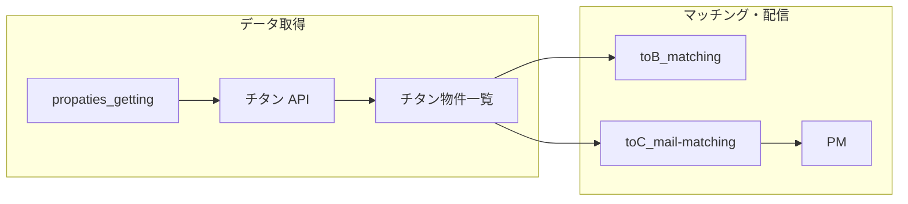

# ワンエルシー関連プロジェクト — 引き継ぎ README

物件データの取得から、企業向け（to B）・個人投資家向け（to C）のマッチング／メールまでを、ドキュメントと Airtable 上の実装に沿って整理した引き継ぎ用の入口です。

**本フォルダ**に、上記3領域のドキュメント一式をまとめています。

---

## 全体像

- **共通の土台**: Airtable（同一ベース `appksEWIuKl7N2ftS` を中心にテーブル・Automation・Interface が配置されている想定）。
- **物件マスタの源泉**: チタン連携で `チタン物件一覧` に取り込んだデータを、to B / to C のマッチングが参照する。

---

## 1. `propaties_getting` — チタンからの物件取得

| 内容 | 参照 |
|------|------|
| フォルダ README | [propaties_getting/README.md](./propaties_getting/README.md) |
| API エンドポイント・FORM 値・エリア分割・格納先 | [propaties_getting/物件取得.md](./propaties_getting/物件取得.md) |

**要点**

- POST `https://www.1lcinc.com/syuuekibukken/php/json_output.php`（FORM パラメータはワンエルシー共有の [スプレッドシート](https://docs.google.com/spreadsheets/d/12h9G54aXjOxWz5K_ko4GdN3H-xQjvu59oHEpPOKsLTo/edit?gid=0#gid=0)）。
- `物件エリア` テーブル単位でリクエストを分けて取得。
- 取得結果は Airtable の **`チタン物件一覧`** に書き込む。
- **Automation（ワークフロー）**: [物件取得 Automation](https://airtable.com/appksEWIuKl7N2ftS/wflqREpmCKeVl0oQz)

**深掘り（別フォルダ）**

- 実行間隔・整形・シーケンスの旧整理: [sentoデータパイプラインシステムアーキテクチャ.md](../終了プロジェクト/reinsからの定期スクレイピング/sentoデータパイプラインシステムアーキテクチャ.md)

---

## 2. `toB_matching` — 企業向け希望条件マッチング

| 内容 | 参照 |
|------|------|
| Airtable リンク集（テーブル・Automation・Interface） | [toB_matching/README.md](./toB_matching/README.md) |
| 提案・背景（Before/After、導入ステップ） | [toB_matching/【to B】企業の希望条件に沿った物件マッチングシステム.md](./toB_matching/【to B】企業の希望条件に沿った物件マッチングシステム.md) |
| 技術スタック回答（Airtable / Postmark / Interface 等） | [toB_matching/技術・運用に関するご回答.md](./toB_matching/技術・運用に関するご回答.md) |
| 企業向けメール実装の経緯・再開方法 | [toB_matching/toB_matching_mail.md](./toB_matching/toB_matching_mail.md) |

**README 記載の主な URL（要アクセス権）**

- [企業一覧](https://airtable.com/appksEWIuKl7N2ftS/tblpOFV0bhskHD2Vz/viwuo9NOZVTMFuZEM?blocks=hide)
- [物件一覧](https://airtable.com/appksEWIuKl7N2ftS/tbllNssTBXGexHysb/viwd3KfQsTlGvfrao?blocks=hide)
- Automation トリガー: [wflcnqVFLd1Z17hQD](https://airtable.com/appksEWIuKl7N2ftS/wflcnqVFLd1Z17hQD)
- マッチングロジック: [wflSLXN8hEunC6nyW](https://airtable.com/appksEWIuKl7N2ftS/wflSLXN8hEunC6nyW)
- [Interface](https://airtable.com/appksEWIuKl7N2ftS/pagw9sdDr8dHyD4mF)

**運用上の注意（`toB_matching_mail.md` より）**

- 企業向けの「アクション履歴更新と同時の自動メール送信」は一旦停止した経緯あり。Interface 上でマッチ結果を確認し、**メール・電話は手作業**という運用とした記述がある。
- メール配信 Automation の再有効化で再開可能、という記載あり（詳細・別ベースの URL は同ファイル内のスクリーンショット・リンクを確認）。

---

## 3. `toC_mail-matching` — 個人投資家向けマッチングメール

| 内容 | 参照 |
|------|------|
| マッチングスクリプト仕様（入出力・条件・Webhook） | [toC_mail-matching/README.md](./toC_mail-matching/README.md) |
| Make からのリプレイス経緯・コード断片 | [toC_mail-matching/【to C】 個人投資家への物件マッチング & makeのリプレイス.md](./toC_mail-matching/【to%20C】%20個人投資家への物件マッチング%20%26%20makeのリプレイス.md) |
| 配信シーケンス（Mermaid・コンポーネント） | [toC_mail-matching/個人投資家へのマッチングメール配信のシーケンス.md](./toC_mail-matching/個人投資家へのマッチングメール配信のシーケンス.md) |
| メールテンプレート（HTML） | `toC_mail-matching/postmark_code/` |

**README 記載の主な URL**

- [個人投資家一覧](https://airtable.com/appksEWIuKl7N2ftS/tbleMuHEGiMZqO2xb/viw9KJ9TfMMengodr?blocks=hide)
- [物件一覧](https://airtable.com/appksEWIuKl7N2ftS/tbllNssTBXGexHysb/viwd3KfQsTlGvfrao?blocks=hide)（to B と共通テーブル）
- [対象 Automation](https://airtable.com/appksEWIuKl7N2ftS/wflu54U87Lag1xNLV)

**要点**

- データソースは **`チタン物件一覧`** ビュー `viwPDkWFB8zHPraRL`。
- 条件一致物件は最大 **5 件**、履歴除外・エリア・種別・構造・予算・利回り・築年・URL 有無など（詳細は toC README）。
- **配信紹介履歴の自動更新**はスクリプト内コメントアウトの記載あり（現状は渡された `history` に依存）。
- 全体フローは Fillout → Airtable → Automation → Postmark という整理が [シーケンス図](./toC_mail-matching/個人投資家へのマッチングメール配信のシーケンス.md) にある。

---

## 技術スタック要約（to B 技術回答と整合）

| 区分 | 内容 |
|------|------|
| DB・業務 UI | Airtable（Interface 含む） |
| スクリプト | Airtable Automation の JavaScript |
| メール送信 | Postmark |
| 物件マスタ取得 | チタン側 API（自社サーバー運用ではない） |
| 汎用クラウド・決済・本番アプリ FW | 利用なし（当該回答の範囲） |

---

## システム仕様書（本フォルダ外）

ワンエルシー配下の包括リンク:

- [システム仕様書 README](../システム仕様書/README.md)
- 企業向けメール・全体図・Airtable ER 図などと相互参照可能。

---

## 引き継ぎ時の確認リスト（最小）

1. Airtable ベース `appksEWIuKl7N2ftS` への権限（テーブル・Automation・Interface）。
2. 物件取得 Automation が期待どおり動いているか（`チタン物件一覧` の更新）。
3. to C: マッチング Automation と Postmark（テンプレ・送信ドメイン）。
4. to B: Interface でのマッチ確認フローと、企業向けメール Automation の**現在有効／無効**の実態。
5. チタン FORM 値スプレッドシート・ワンエルシー共有ドキュメントの所在。

---

*配置: `ワンエルシー/projects/引き継ぎ/` 配下に `propaties_getting` / `toB_matching` / `toC_mail-matching` を収容。*
