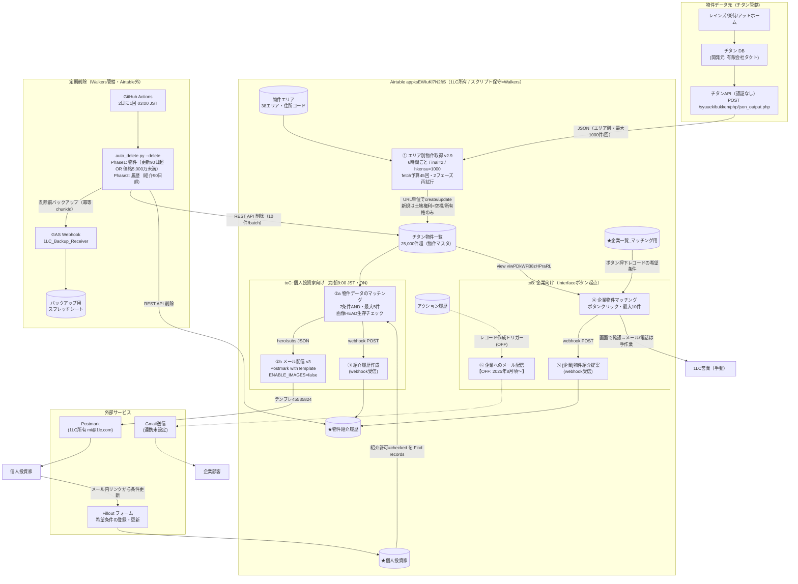
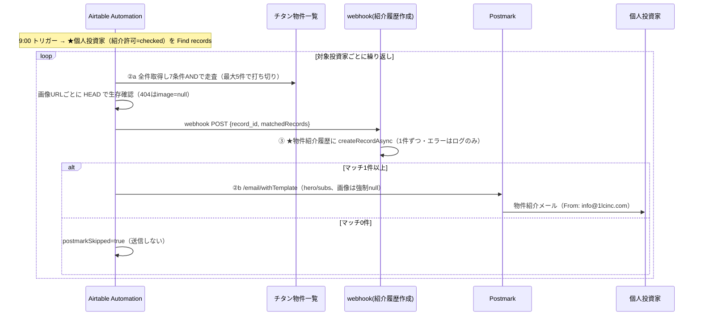

# 1LC 不動産マッチングシステム データフロー全体図

作成日: 2026-07-25（監査吸い出し `00_automation構造一覧.txt` / スクリプト01〜06 / 引き継ぎ資料 / auto_archive / context.md に基づく。読み取り専用調査）

Airtable ベース: `appksEWIuKl7N2ftS`（CRM。DB・Automation・Interface すべてこの1ベースで完結。バックエンドサーバーなし）

---

## 1. 全体図（mermaid）

## 2. toC 配信の時系列（毎朝9:00 JST）

---

## 3. コンポーネント別 詳細表

凡例: 責任者 = W(Walkers) / L(1LC) / T(チタン・タクト)

### 3.1 ① エリア別物件取得 v2.9（Automation `wflqREpmCKeVl0oQz`・ON）

| 項目 | 内容 |
|---|---|
| トリガー/頻度 | 定時実行・**6時間ごと** |
| 入力 | `物件エリア` テーブル（38エリア・住所コード）、チタンAPI `json_output.php`（POST。`fm=baibai`, **`inai=2`**（=直近2日以内に掲載/更新された物件のみ）, `jusyoc`=エリアコード, `yachik/yachij`=5,000〜200,000（万円）, **`hkensu=1000`**） |
| 出力 | `チタン物件一覧` へ create / update（batch 50件）。`output.set` で created / updated / writeErrors / unknownTokens / aborted のサマリ |
| 主要ロジック | URL単位で全エリア分を統合（**URLが重複排除キー**）。既存レコードは無条件update＋**エリアlinkはマージ**（複数エリアに載る物件は link 統合）。新規createのみ「土地権利=空欄 or 所有権」に限定。**価格 0超〜5,000万未満は取り込まない**。URL欠落物件はスキップ。select型はホワイトリスト照合（NFKC正規化・未知値は間引いて空欄登録）。数値は `num()` ガードで NaN を書き込まない |
| 制限値 | **FETCH_BUDGET=45**（Airtable上限50回/実行に対する安全マージン）、fetchタイムアウト30秒、実行180秒・512MB、レスポンス4.5MB、書き込みbatch=50 |
| エラー時 | fetch失敗はエリア単位で見送り→フェーズ2で残予算内再試行→それでも失敗なら**次回6時間後に委ねる**。未登録select値が全体の20%超（かつ20トークン以上）なら書き込み中止（安全弁）。書き込みエラーはログのみ（**通知なし**）。新規0件時は警告ログのみ |
| 責任者 | スクリプト=W（naru）、Automation実行環境・選択肢メンテ=L（岩下・Airtable UI操作）、API側=T |

### 3.2 ② toC マッチング配信（Automation「[本番]Airtableメール配信希望条件転送」・ON）

| 項目 | ②a マッチング | ②b メール配信 |
|---|---|---|
| トリガー/頻度 | 毎日 **9:00 JST**。`★個人投資家`（紹介許可=checked）を Find records → 1人ずつ Repeat | ②a の直後（同一 Repeat 内） |
| 入力 | 投資家の希望条件（kinds/budget/structures/profit上下限/years/area/history 等）＋ `チタン物件一覧` **全件**（`selectRecordsAsync`・view指定なし） | ②a の heroJson/subsJson/conditionsSummary/matchedCount ＋ name/email/edit_link |
| マッチ条件 | 7条件AND: 履歴未紹介（**「メール埋め込み」文字列で照合**）/ エリア正規表現 `^(A\|B\|…)` / 種別（こだわらない可）/ 構造（こだわらない可）/ 価格範囲 / 利回り上下限 / **築年: `age > years`** / URLあり。**最大5件**で打ち切り。※「バス・徒歩(整形)」は読み取るが**条件未使用** | matchedCount=0 なら送信スキップ |
| 出力 | hero(1件目・画像付き優先)/subs(2件目以降)、webhook POST → ③ | Postmark `/email/withTemplate`（TemplateId **45535824** = v3本番、From `info@1lcinc.com`） |
| 制限値 | 5件上限。**画像1件ごとに HEAD fetch**（Automationのfetch上限50回を消費） | **ENABLE_IMAGES=false**（画像透かし問題が解決するまで全画像null＝実質テキストのみ） |
| エラー時 | レコード単位で try-catch → debugLog に積むだけ（未通知） | Postmark非2xxで throw（Automation実行失敗）。**リトライなし** |
| 責任者 | W（スクリプト）/ L（投資家データ・紹介許可の運用） | Postmarkアカウント=L（mi@1lc.com）、テンプレ・配信実務=W（池田） |

### 3.3 ③ 紹介履歴作成（Automation `wflSLXN8hEunC6nyW`・ON）

| 項目 | 内容 |
|---|---|
| トリガー | webhook受信（②a からの POST） |
| 処理 | matchedRecords を1件ずつ `★物件紹介履歴` に createRecordAsync（`★個人投資家` link = record_id、`物件紹介_投資家` link = 各マッチ物件） |
| エラー時 | createRecordAsync の失敗は catch してログのみ。**履歴が作れなくてもメール配信は止まらない**（＝履歴欠落→翌日同一物件を再紹介するリスク） |
| 要確認 | スクリプトは `[{ id: record }]` と**マッチ結果をそのままIDとして**渡すが、②a v2 の matchedRecords はオブジェクト配列（`airtable_record_id` プロパティ入り）。webhook入力のマッピングで ID 配列に変換されていなければ全件挿入エラーになる型不整合が**コード上は**存在する（実挙動は Automation の input.config 設定に依存。未検証） |
| 責任者 | W |

### 3.4 ④ 企業物件マッチング（Automation `wflcnqVFLd1Z17hQD`・ON）

| 項目 | 内容 |
|---|---|
| トリガー | Interface 上の**ボタンクリック**（企業レコード単位・手動起点） |
| 入力 | 企業の希望条件（kinds/budget/structures/profitLower/years/area/history）＋ `チタン物件一覧` の **view `viwPDkWFB8zHPraRL`** |
| マッチ条件 | 履歴未紹介 / URL（**「変更後リンク」フィールド**）あり / 価格範囲 / **利回り下限は `parseFloat(profitLower)×100`**（入力スケール変換）/ エリア正規表現 / 種別・構造（こだわらない可）/ **築年: `age <= years`**（toCと不等号が逆）。**最大10件**（コメント: 重くならないため） |
| 出力 | webhook POST → ⑤、output に infos / matchedCount / matchedRecords |
| エラー時 | レコード単位 try-catch、debugLog のみ |
| 責任者 | W（スクリプト）/ L（ボタン運用＝営業が押す） |

### 3.5 ⑤ [企業]物件紹介提案（Automation `wflko7uZj184zCoea`・ON）

③ と同型（`★企業一覧_マッチング用` / `★物件紹介_企業用` link で `★物件紹介履歴` に挿入）。③と同じ `{id: record}` 型不整合の懸念あり。責任者 W。

### 3.6 ⑥ 企業へのメール配信（Automation `wflegrxzcddPbj9yD`・**OFF**）

| 項目 | 内容 |
|---|---|
| 状態 | **OFF（2025年8月頃から放置・未稼働）**。Gmail のGoogleアカウント連携が未設定のため |
| 設計 | `アクション履歴` にレコード作成 → 条件（結果=「メール送付｜物件紹介」・公開用URLあり・過去紹介なし）→ スクリプトが物件名/URLを `[name](url)` の ` ` 連結HTMLに整形 → Gmail送信アクション |
| 現実の運用 | toB は ④ の結果を営業が Interface で確認し、**メール/電話は手作業** |
| 責任者 | W（再開時の設定）/ L（Gmailアカウント・営業運用） |

### 3.7 定期削除 auto_archive（Airtable外・GitHub Actions・稼働中）

| 項目 | 内容 |
|---|---|
| トリガー/頻度 | GitHub Actions cron **2日に1回 03:00 JST**（`airtable-cleanup.yml`）で `auto_delete.py --delete --yes` |
| 条件 | Phase1 物件: `更新日` が90日超前 **OR 価格 < 5,000万円**。Phase2 履歴: `紹介日時` が90日超前 |
| バックアップ | 削除前に GAS Webhook（`1LC_Backup_Receiver`）経由でスプレッドシート `1C8JUe268…` へ退避。**冪等性キー(chunkId)で重複書き込み防止**。バックアップ失敗時フォールバック＋Actions失敗通知あり |
| 安全機構 | MAX_DELETE 60,000件/phase、異常比率3.0倍で停止、総レコード110,000件でアラート閾値。REST API: 削除batch=10・sleep0.25秒・リトライ8回 |
| 責任者 | W（naru。Walkersリポジトリ上で稼働） |

### 3.8 パイプライン外の関連系

| 系 | 状態 | 内容 |
|---|---|---|
| Fillout フォーム | 稼働中 | 個人投資家の希望条件の登録・更新。メール内リンク（edit_link）から更新→Airtableへ保存 |
| 岩下氏の並行運用 | 稼働中（システム外） | 岩下氏自身が Claude Code で Airtable/チタンAPIからデータ取得→スプレッドシートでマッチング→営業事務が手動メール。本パイプラインと二重系 |
| バックログ回収スクリプト | 手動・随時 | `backlog_recover_dryrun.py` / `backlog_recover_exec.py`。inai=7 で照会し取得停止期間の欠落を REST API（typecast有効）で一括登録。2026-07-25 に392件回収実績 |
| 土地大臣（会員サイト） | 稼働中（チタン提供） | メールのクリック遷移先。リプレイス方針（自作マイページ）あり |
| デッドマンスイッチ・異常通知 | **未実装（Phase 2 予定）** | v2.9 の output サマリ（writeErrors/unknownTokens）は出力のみで通知未接続。「24時間新規0件」検知も未実装 |
| 画像表示（②b） | **凍結（ENABLE_IMAGES=false）** | 画像の透かし（あみがけ）問題が解決するまでメールは画像なし |

---

## 4. 状態サマリ（凍結・OFF・テスト・既知の注意点）

| # | 対象 | 状態 |
|---|---|---|
| 1 | ⑥ 企業へのメール配信 | **OFF**（2025-08頃〜。Gmail連携未設定。toBメールは手作業） |
| 2 | ②b 画像表示 | **凍結**（ENABLE_IMAGES=false） |
| 3 | 異常通知・デッドマンスイッチ | **未実装**（Phase 2予定。現状は console.log と output.set のみ） |
| 4 | 掲載終了検知 | **仕組みなし**（inai=2 は新着/更新のみ。物件は90日滞留 or 価格条件でしか消えない） |
| 5 | ③⑤ の履歴挿入 | コード上、matchedRecords（オブジェクト配列）を link ID として渡す**型不整合の疑い**（要実機確認） |
| 6 | toC 築年条件 `age > years` | toB（`age <= years`）と**不等号が逆**。仕様意図（「築◯年以上を希望」か「以内」か）の確認要 |
| 7 | Postmark APIトークン | ②b スクリプトに**平文ハードコード**（引き継ぎ資料にも露出。ローテーション推奨済み） |
| 8 | チタンAPI | **認証なし・平文**（暗号化/認証をチタンへ依頼中） |
| 9 | 取得の事故履歴 | 2026-07-22〜25 未登録select値で新規create 4日間全滅（v2.9で構造対策済み・455件回収済み） |
