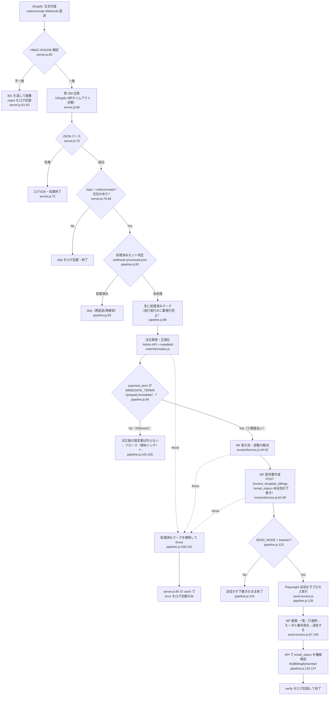
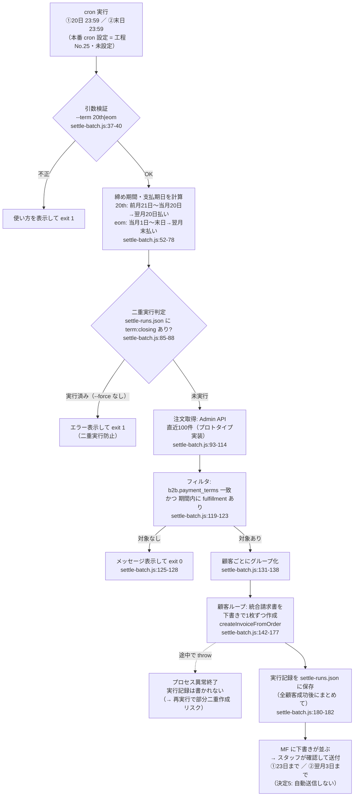
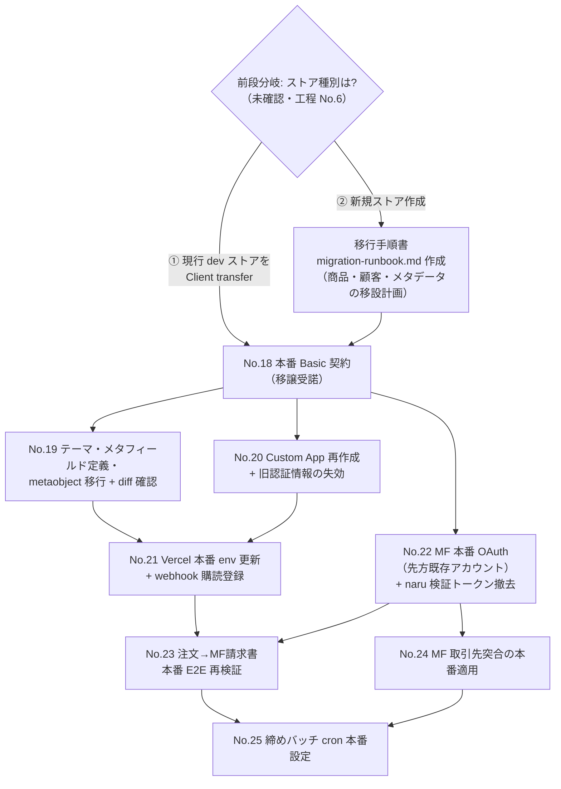
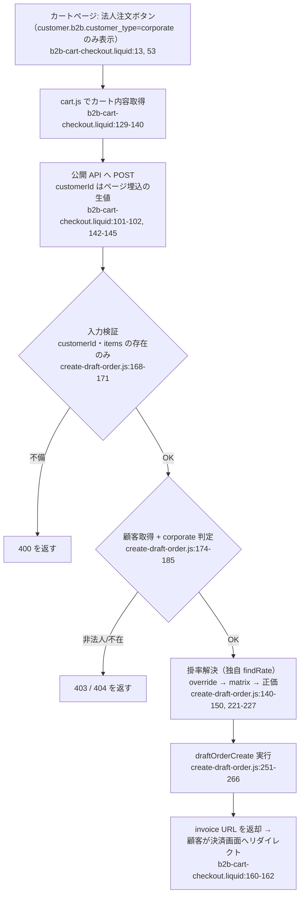

# 完全理解設計書 — 処理フロー図

最終更新: 2026-07-22
ステータス: クロスレビュー反映済み（Haiku+引用検証217件+Codex 見落とし検出。naru 逆レビュー QA 待ち）

> 目的: 3本の主要フローを頭の中で再生でき、「このステップが失敗したらどうなる？」に即答できる状態を作る。
> 失敗時挙動は**コードを読んだ根拠付き**（ファイル名:行）で記載する。コードで確認できない挙動は「要実機確認」と明示し、憶測で「リトライされる」とは書かない。

対象コード（BASE = `03_projects/落合コーポレーション`）:

| ファイル | 役割 |
|---|---|
| `webhook/server.js` | orders/create Webhook 受信（HMAC検証・即200・非同期処理）。 |
| `webhook/pipeline.js` | 共通パイプライン（支払区分判定・二重発行防止・送信・検証）。 |
| `webhook/settle-batch.js` | 締めバッチ（①②かけ払いの顧客別統合下書き作成）。 |
| `shopify/src/orderNormalize.js` | Shopify 注文 → 正規化JSON 変換。 |
| `moneyforward/src/invoiceService.js` | MF 取引先・部署解決 → 請求書作成。 |
| `moneyforward/src/mfClient.js` | MF API クライアント（401 時のトークン自動リフレッシュ）。 |
| `mf-automation/send-invoice.js` | Playwright による MF 画面のメール送信代行（A-2）。 |
| `webhook/vercel-deploy/api/webhook.js`・`lib/pipeline.js` | フロー①の **Vercel 本番版**（ローカル版との差分は §1-3）。 |
| `webhook/vercel-deploy/api/create-draft-order.js` | 業者様向け（B2B）カート → Draft Order 作成 API（フロー④）。 |
| `shopify-theme/snippets/b2b-cart-checkout.liquid` | カートページの発注ボタンと上記 API の呼び出し（フロー④）。 |

> **注意**: フロー①の図・表はローカル版（server.js＋pipeline.js）を基準に記載する。本番デプロイ対象の Vercel 版は二重処理防止・自動送信・検証の3点で挙動が異なる（**§1-3 に差分表**）。

---

## フロー① B2B注文（③都度払い）→ webhook → MF請求書 即時発行・自動送信

### 1-1. フロー図

### 1-2. ステップ表（失敗時挙動・冪等性）

| # | ステップ | 実装 | 失敗したらどうなるか | リトライ・冪等性 |
|---|---|---|---|---|
| 0 | サーバ起動 | server.js:29-32 | `SHOPIFY_WEBHOOK_SECRET` 未設定なら起動を中止する（`process.exit(1)`）。 | 起動時ガードのみ。稼働中のプロセス死活監視はコード内に無い（要実機確認: Vercel 等の再起動挙動）。 |
| 1 | HMAC 検証 | server.js:35-41, 60-63 | 不一致は **401 で破棄**し、`reject` をログに記録する。処理には一切入らない。 | 401 応答後に Shopify が再配送するかは Shopify 側仕様（コード外・要実機確認）。 |
| 2 | 即 200 応答 | server.js:66 | 検証通過後、**処理前に 200 を返す**。以降の処理失敗は Shopify から見えない＝**Shopify 再配送によるリトライは期待できない**。 | 200 は Shopify の 5 秒タイムアウト対策として意図的。以降の失敗回復は本表 #6 の仕組みに依存する。 |
| 3 | JSON パース／topic・注文ID 判定 | server.js:70-84 | パース失敗・対象外 topic・注文ID 無しは**ログのみ記録して終了**（握りつぶし。通知なし）。 | なし。既に 200 応答済みのため再配送も来ない。 |
| 4 | 二重処理防止 | pipeline.js:29-48, 82-86 | 処理済み注文 GID は `output/webhook-processed.json` の永続セットで skip。**処理開始時に先へマーク**するため、並行して同じ注文が届いても二重発行しない。 | 冪等（注文 GID 単位）。ファイル永続なのでプロセス再起動後も維持される。 |
| 5 | 注文取得・正規化 | orderNormalize.js:39-59 | 注文が見つからなければ throw（→ #6 へ）。ダミー email（example.com 等）は demo 受信先 `naru.hosoya+shopifydemo@...` に置換される（orderNormalize.js:9-16。**本番前に要見直し**）。 | 明細の取得は `lineItems(first: 50)` 固定でページングが無い（orderNormalize.js:26-32。Vercel 版 lib/orderNormalize.js:29-35 も同様）。**51 行目以降の明細はエラーにならず黙って請求から漏れる**（→ 07 D-1）。 |
| 6 | 請求書「作成前」の失敗 | pipeline.js:88-115 | fetch／MF 請求書作成が throw したら**処理済みマークを解除**して `retryable-error` を記録し re-throw。server.js:85 の catch は**ログ記録のみ**で何もしない。 | マーク解除により「次の検知」でリトライ可能だが、Webhook 経路は 200 応答済みで再配送が来ないため、**実際に再試行されるのは watch.js（ポーリング監視）併用時のみ**（pipeline.js:4 のコメント。常用構成かは要実機確認）。自動リトライ・アラート通知は無い。 |
| 7 | かけ払い判定 | pipeline.js:94, 102-105 | `payment_term` が `prepaid`/`immediate` 以外（20th/eom/null 含む）は注文毎の請求書を**作らずに正常終了**。①②はフロー②の締めバッチに一本化（D-3: 注文毎下書きは二重請求リスク）。 | metafield 未設定（null）も「かけ払い側」に落ちる安全側の設計。 |
| 8 | MF 取引先・部署の解決 | invoiceService.js:23-55 | `mf_partner_id` metafield があれば既存取引先を再利用（決定8）。**無ければ毎回新規 POST /partners**。department_id は 3 段フォールバック（インライン→POST 作成→GET 取り直し）で解決し、どうしても取れなければ明示 throw（undefined を送らない）。 | 注意: 作成した partner_id を Shopify metafield へ**書き戻す処理はパイプライン内に無い**ため、metafield 未設定の顧客は注文のたびに MF 取引先が重複作成され得る（ローンチ工程 No.24「MF取引先突合」の対象）。 |
| 9 | MF API 認証（401） | mfClient.js:43-71 | 401 なら (1) ディスクのトークンを読み直し（別プロセスが先にリフレッシュ済みのケース）、(2) それでも 401 なら `refreshTokens()` で**1回だけ**リフレッシュして再試行。リフレッシュも失敗すれば throw（→ #6 の経路）。 | リトライは 401 時の 1 回のみ。refresh_token 自体が無効な場合は `npm run auth` での**手動再認可が必要**（mfClient.js:87-89 のエラーメッセージ）。 |
| 10 | MF 請求書作成 | invoiceService.js:62-69 | `POST /invoice_template_billings`。作成された請求書は必ず `email_status=未送信`（下書き）。失敗は throw（→ #6）。**支払期日**: ③経路は `due_at`／`payment_term_days` を渡さないため、mapOrder.js:103-104 の既定値 **請求日+30日** が入る（spec の「請求日+7日」と未整合 → 00 Z-2・07 D-3）。 | **請求書作成後の失敗は処理済みマークを残す**（pipeline.js:88-89 のコメント）＝再実行しても二重発行しない設計。裏返しに、作成後に落ちた場合の送信リトライも自動では行われない。 |
| 11 | SEND_MODE 判定 | pipeline.js:123-126 | `browser` 以外なら「③都度払いだが送信せず下書きのまま」と記録して終了。 | — |
| 12 | Playwright 送信（A-2） | pipeline.js:63-75, 128-129 / send-invoice.js | 子プロセスの exit code で成否判定。**失敗（ok:false）でもログに記録するだけで処理は続行**し、リトライ・通知は無い（握りつぶし）。send-invoice.js 側の安全装置: セッション切れ→スクショ＋候補一覧を debug/ に出力して exit 1（send-invoice.js:75-78）／既に「送付済み」なら**何もせず正常終了**＝二重送信防止（send-invoice.js:93-97）／送信モーダルの請求書番号を照合し、不一致は 1 回やり直し、2 回目も不一致なら誤送信防止のため中止（send-invoice.js:103-146）。 | 「送付済みスキップ」により**同じ請求書番号への再実行は冪等**。MF の UI 変更で壊れる脆さは既知（send-invoice.js:10 のコメント）。 |
| 13 | API 検証 | pipeline.js:131-137 / invoiceService.js:77-81 | `GET /billings?document_number=` で `email_status` を取得し、`verified: true/false` をログに記録する。**false（未送信のまま）でも後続アクションは無い**（握りつぶし。人がログを見ない限り気づけない）。 | 検証自体の失敗は `(取得失敗)` として記録されるのみ。 |

> **このフローの回復モデルの要点**: 「請求書作成**前**の失敗＝マーク解除でリトライ可能（ただしリトライ主体は watch.js 併用が前提）」「作成**後**の失敗＝マーク維持で二重発行ゼロを優先（送信失敗はログに残るだけ）」という非対称設計。送信失敗・検証 NG の**能動的な通知経路が現状無い**ことがローンチ前の残課題。

### 1-3. Vercel 本番経路（webhook/vercel-deploy/）との差分

上記 §1-1〜§1-2 はローカル版（server.js＋pipeline.js）基準の記述。本番デプロイ対象の Vercel 版（api/webhook.js＋lib/pipeline.js）は次の3点で挙動が異なる。

| 差分 | ローカル版 | Vercel 本番版 |
|---|---|---|
| 二重処理防止（#4） | `output/webhook-processed.json` の**永続ファイル**（pipeline.js:29-48）。プロセス再起動後も維持され、再配送・再検知に対して冪等。 | **インメモリ Set のみ**（api/webhook.js:49-65）。コールドスタート・複数インスタンスで消えるため、**再配送のタイミング次第で同一注文の請求書が二重発行され得る**。コード内コメント自身が「本格運用では Vercel KV／Upstash Redis へ移行」と明記しており（api/webhook.js:52-54）、KV 移行までは暫定状態。 |
| 自動送信（#11〜12） | `SEND_MODE=browser` で Playwright 送信を子プロセス実行（pipeline.js:122-129）。 | **非対応**。`SEND_MODE=browser` を設定しても警告ログを出すのみで、**下書き作成＋注文 metafield 書戻し（Z-11）までで終了**する（lib/pipeline.js:94-105）。③都度払いの送付は別途ローカル Playwright（mf-automation/send-invoice.js）または MF 画面からの手動送付が必要（→ 07 D-3）。 |
| email_status 検証（#13） | `findBillingByNumber` で送信結果を機械検証（pipeline.js:131-137）。 | **実行されない**（lib/pipeline.js:12 で import はあるが呼び出しが無い）。本番経路には送信成否をデータで確認するステップが存在しない。 |

---

## フロー② 締めバッチ（①20日締め／②末締め かけ払い）

### 2-1. フロー図

### 2-2. ステップ表（失敗時挙動・冪等性）

| # | ステップ | 実装 | 失敗したらどうなるか | リトライ・冪等性 |
|---|---|---|---|---|
| 1 | cron 起動 | 本番未設定（ローンチ工程 No.25）。 | cron が実行されなかった場合（サーバ停止等）を**検知する仕組みはコード内に無い**。締め漏れは人が気づくしかない。 | `--closing` 省略時は「直近の締め日」を自動計算する（settle-batch.js:52-63）ため、**遅れて実行しても正しい期間で締められる**（数日以内の手動リカバリが可能）。 |
| 2 | 二重実行防止 | settle-batch.js:80-88 | 同じ `term:closing` の実行記録が `output/settle-runs.json` にあれば exit 1。やり直しは `--force` 明示が必要。 | 実行記録単位の冪等。ただし #5 の部分失敗ケースに穴がある（下記）。 |
| 3 | 注文取得 | settle-batch.js:93-114 | Admin API 失敗は throw → プロセス異常終了（記録は書かれないので再実行可）。**取得は「直近 100 件」固定のプロトタイプ実装**（settle-batch.js:93 のコメント）で、締め期間の対象が 100 件を超えると**黙って漏れる**。本番前にページング or 期間クエリ化が必要。 | 明細も `lineItems(first: 50)` 固定（settle-batch.js:105-110）で、**1注文 51 行目以降の明細は黙って請求から漏れる**（フロー① #5 と同根 → 07 S-2）。 |
| 4 | 対象フィルタ | settle-batch.js:116-123 | `b2b.payment_terms` が term と一致し、かつ期間内（JST 換算の発送日）に fulfillment がある注文のみ。fulfillment が1つも無い注文は含まれない（決定4: 請求確定=発送時。ローカル検証済み）。**ただし判定は注文単位**: fulfillment の**いずれか1つでも**期間内なら、その注文の**全明細（未発送分を含む）**を請求対象にする（settle-batch.js:119-123, 145-152）。部分発送の注文では未発送明細まで請求され、fulfillment が複数の締め期間に跨る注文は**翌期の締めでも再度全明細が対象になり二重請求し得る**。明細行の日付も先頭 fulfillment の日付で固定（settle-batch.js:146）。 | **返品・キャンセルの除外は現状未実装**（settle-batch.js:13 のコメント「返品・キャンセル(d)は未実装（確認待ち）」）。返品済み注文も金額に乗る。**ローンチ工程 No.14 で対応予定**。 |
| 5 | 顧客ループ（下書き作成） | settle-batch.js:142-177 | 顧客ごとに逐次 `createInvoiceFromOrder`。**途中の顧客で throw すると、そこでプロセスが異常終了し、実行記録（settle-runs.json）は書かれない**（記録は全顧客成功後の settle-batch.js:180-182 のみ）。この状態で再実行すると二重実行判定を素通りし、**成功済み顧客の請求書が二重に下書き作成される**（顧客単位のマークが無いため）。ただし下書き止まり（決定5）なので、スタッフ確認の段で人が気づける建付け。 | 顧客単位の冪等性は**無い**。部分失敗時のリカバリは「MF 上の下書きを目視で突合してから再実行」が現状の運用手順（要ルール化）。 |
| 6 | MF API 認証 | mfClient.js:43-71 | フロー①#9 と同一（401 → ディスク再読込 → 1 回だけリフレッシュ → 失敗なら throw）。 | 同左。 |
| 7 | 取引先解決 | settle-batch.js:161 / invoiceService.js:44-55 | 顧客 metafield `b2b.mf_partner_id` があれば再利用。無ければ**締めのたびに新規 MF 取引先が作られる**（フロー①#8 と同じ重複リスク。工程 No.24 の突合対象）。 | — |
| 8 | 実行記録の保存 | settle-batch.js:179-182 | 全顧客成功後に `settle-runs.json` へ runKey・期間・作成請求書番号を記録。この書き込み自体が失敗した場合（ディスク要因等）は異常終了し、#5 と同じ再実行二重リスクになる。 | — |
| 9 | スタッフ確認・送付 | コード外（決定5） | 下書きのまま送付を忘れても**システムからのリマインドは無い**。①は 23 日まで、②は翌月 3 日までに人が送付する運用。 | — |

> **仮仕様として明記されているもの**: 明細粒度は「MM/DD 注文番号 商品名 × 数量 @確定単価」の商品行（確認事項 #2(a) 待ち。settle-batch.js:12, 149）。統合請求書の売上計上日=締め日も仮（settle-batch.js:157）。

---

## フロー③ 本番移行（ローンチ工程 D カテゴリ No.18〜25）

### 3-1. 依存関係図

### 3-2. ステップ表（依存・確認ポイント）

| # | 工程 | 依存 | 確認ポイント・注意 |
|---|---|---|---|
| 前段 | ストア種別の確認（工程 No.6） | — | Client transfer（現行 dev ストアの移譲）か、新規ストア作成かが**未確認**。②新規ストアの場合は移行手順書（migration-runbook.md）の作成が No.18 の前に挟まる。 |
| 18 | 本番 Basic 契約（移譲受諾） | 前段分岐の確定。 | 以降の全工程の起点。 |
| 19 | テーマ・メタフィールド定義・metaobject 移行 + diff 確認 | No.18。 | `b2b.*` metafield（payment_terms / mf_partner_id 等）と discount_matrix metaobject が揃わないと、フロー①の支払区分判定（pipeline.js:94）とフロー②の対象フィルタ（settle-batch.js:120）が**全件 null → 全部かけ払い側に落ちる**。diff 確認が実質の安全網。 |
| 20 | Custom App 再作成 + 旧認証情報の失効 | No.18。 | Webhook の HMAC 署名キー＝カスタムアプリの API シークレットキー（server.js:16 のコメント）。**App を作り直すとキーが変わる**ため、No.21 の env 更新とセットで行わないと本番 Webhook が全件 401 破棄になる。 |
| 21 | Vercel 本番 env 更新 + webhook 購読登録 | No.19, No.20。 | `SHOPIFY_WEBHOOK_SECRET` / `SEND_MODE` / `IMMEDIATE_TERMS` 等の本番値を投入し、orders/create の購読先を本番 URL に登録。dev ストアの注文は全てテスト注文のため、**本番投入時に payload.test の扱いを決める**必要あり（server.js:20 のコメント。現状コードは test フラグを見ていない）。 |
| 22 | MF 本番 OAuth（先方既存アカウント） + naru 検証トークン撤去 | No.18。 | mfClient.js のトークンはディスク保存（tokens.js 経由）。先方アカウントでの再認可後、naru の検証トークンを確実に撤去する。Playwright 送信（A-2）は別途 **MF 画面のログインセッション**（mf-automation/.auth/mf-state.json）も先方アカウントで `npm run login` し直す必要がある（send-invoice.js:39-42。API トークンとは独立した認証）。 |
| 23 | 注文→MF請求書 本番 E2E 再検証 | No.21, No.22。 | フロー①を本番構成で通しで確認（HMAC・③判定・請求書作成・A-2 送信・email_status 検証）。orderNormalize.js:9-16 の**ダミー email→demo 受信先置換が本番に残っていないか**もここで確認する。 |
| 24 | MF 取引先突合の本番適用 | No.22。 | 既存顧客へ `b2b.mf_partner_id` を張る作業。これをやらないとフロー①#8／フロー②#7 の通り**注文・締めのたびに MF 取引先が重複作成される**。 |
| 25 | 締めバッチ cron 本番設定 | No.23, No.24。 | 20日/末日 23:59 JST（決定6）。設定後、フロー②#1 の「cron 不発の検知が無い」問題への運用手当（実行ログの定期確認等）を決めておく。settle-batch.js の**直近 100 件制限（プロトタイプ）の本番化**もこの工程までに要解消。 |

---

## フロー④ 業者様向け（B2B）カート → Draft Order 作成（発注入口・Vercel Function）

> 現行方針 (b) の発注入口（未確定リスト #4・古谷さん合意待ち）。フロー①の**手前**に位置する。

### 4-1. フロー図

### 4-2. ステップ表（失敗時挙動・セキュリティ）

| # | ステップ | 実装 | 失敗したらどうなるか・注意 |
|---|---|---|---|
| 1 | API 受付 | create-draft-order.js:19-23, 159-171 | **認証が一切無い公開 POST**。CORS は `Access-Control-Allow-Origin: *`（:19-23）で、検証は customerId・items の存在チェックのみ（:168-171）。**Shopify App Proxy の署名検証・セッション検証・レート制限のいずれも無い**（ファイル内に該当コード無し・grep 確認済み）。 |
| 2 | 顧客同定 | b2b-cart-checkout.liquid:102 ／ create-draft-order.js:174-185 | customerId は**クライアント側 JS に埋め込まれた自己申告値**をそのまま信用する。サーバ側ガードは「その顧客が corporate か」の metafield 判定のみ（:182-185）。**第三者が数値 ID を推測して任意の法人顧客宛の Draft Order を大量作成できる**ほか、403／404 の応答差で顧客 ID の在庫（法人か否か）を列挙できる。掛率そのものはサーバ側計算のため、**価格改ざんはできない**（送れるのは variantId と数量のみ — :156）。 |
| 3 | 失敗時の UI | b2b-cart-checkout.liquid:164-169 | エラーはカートページにメッセージ表示のみ。**サーバ側の失敗（5xx）もエラーメッセージが顧客に露出する**（:296-299 で message を返却）。運用側への通知は無い。 |
| 4 | 掛率解決 | create-draft-order.js:140-150, 221-227 | discountEngine.js を import せず独自 `findRate` を再実装（Z-6・03 横断所見1）。**値の範囲検証が無く**、`parseFloat` が通る負値・1 超がそのまま採用される（詳細は 03 横断所見1）。 |
| 5 | Draft Order 作成後 | create-draft-order.js:268-293 | 成功ログは console.log のみ（Vercel ログ）。**不審な Draft Order の増加を検知する仕組みは無い**（→ 07 D-5）。 |

> **対策の方向性（未実装・仕様変更シナリオ）**: Shopify App Proxy 経由に変更してリクエスト署名を検証する／レート制限を入れる。影響範囲と工数は 03 シナリオ 11 を参照。

---

## 付録: 「失敗しても何も起きない」箇所の一覧（横断）

ローンチ前にアラート経路（通知・監視）を検討すべき箇所。いずれもログ（`output/webhook-events.jsonl` またはコンソール）には残るが、**人へ能動的に通知されない**。

| 箇所 | 根拠 | 影響 |
|---|---|---|
| Webhook 処理本体のエラー（注文取得・MF 作成の失敗） | server.js:85（catch でログのみ）。 | 200 応答済みのため Shopify 再配送は来ず、watch.js 併用が無ければ請求書が発行されないまま気づけない。 |
| Playwright 送信失敗（③都度払い） | pipeline.js:128-129（ok:false をログに記録して続行）。 | 請求書が下書きのまま顧客に届かない。 |
| email_status 検証 NG | pipeline.js:131-137（verified:false を記録するのみ）。 | 同上（送信できていない事実がログにしか残らない）。 |
| 締めバッチの部分失敗 → 再実行 | settle-batch.js:180-182（実行記録は全顧客成功後のみ）。 | 成功済み顧客の下書きが二重作成される（下書き止まりのため人の確認で捕捉可能だが、仕組み上の防止は無い）。 |
| 締めバッチ cron 不発 | コード外。 | 締め漏れ。`--closing` 自動計算により遅延実行でのリカバリは可能。 |
| 締めバッチの対象取得が直近 100 件固定 | settle-batch.js:93-94（プロトタイプ実装のコメント）。 | 対象注文が 100 件を超えると黙って請求漏れになる。本番前に要解消。 |
| 明細取得の `lineItems(first: 50)` 固定 | shopify/src/orderNormalize.js:26-32・webhook/vercel-deploy/lib/orderNormalize.js:29-35・settle-batch.js:105-110（3 実装共通・ページング無し）。 | 1 注文 51 行以上の明細が黙って請求から漏れる。 |
| Draft Order 作成 API への不正リクエスト | create-draft-order.js:19-23（CORS *）・168-171（存在チェックのみ）・182-185（corporate 判定のみ）。認証・レート制限無し（フロー④ #1〜#2）。 | 第三者による Draft Order の大量作成・顧客 ID 列挙が起きても検知されない。 |
| Shopify／MF API の 429・5xx | webhook/vercel-deploy/lib/shopifyClient.js:72-78（throw のみ）・lib/mfClient.js:81-94（リトライは 401 時の 1 回のみ）。ローカル版 mfClient.js も同様に 401 のみ。 | 一過性のレート制限・障害でも即 `retryable-error` で終わり、**backoff 付き再試行が無い**。回復は再配送・再検知頼みで、Vercel 経路は dedup が揮発（§1-3）している場合のみ再処理される。 |
| Vercel 本番経路の送信・検証の不在 | webhook/vercel-deploy/lib/pipeline.js:94-105（§1-3）。 | ③都度払いが下書き止まりでも通知されず、送付漏れが日次確認（07 D-3）でしか捕捉できない。 |
