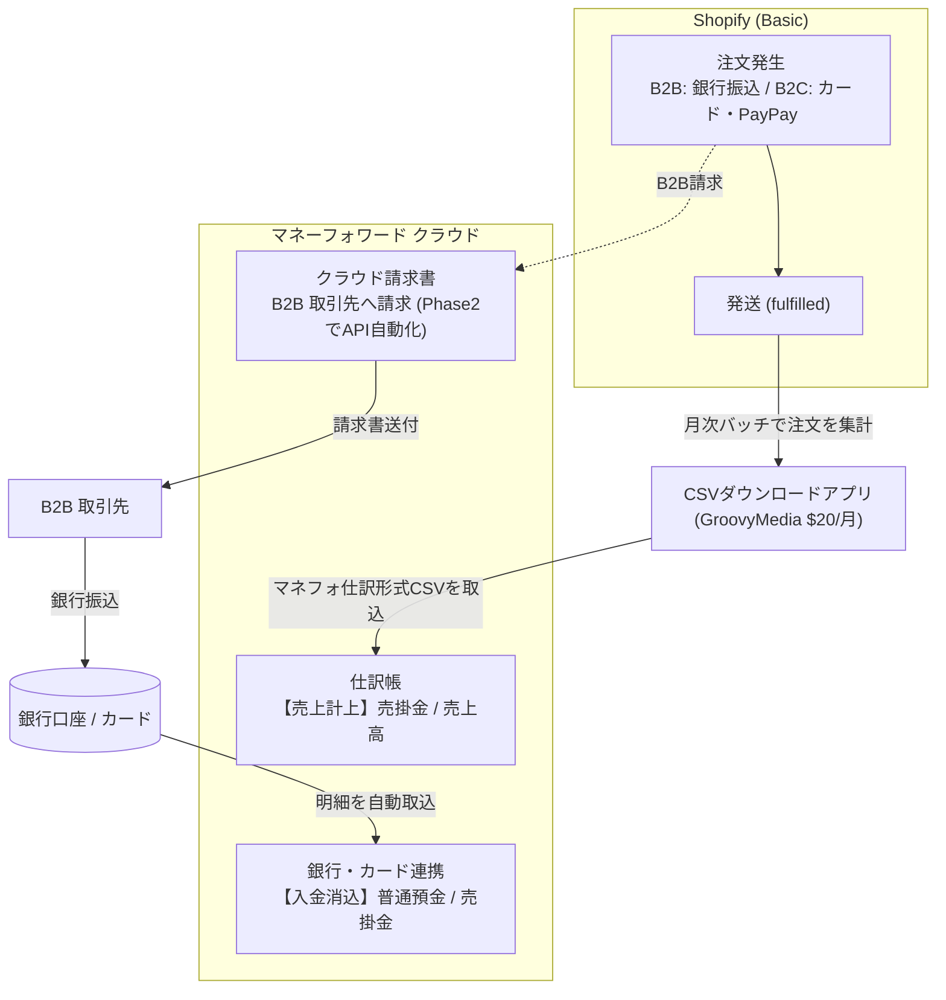

# マネフォ連携・データ統合 調査

最終更新: 2026-06-01（naru セッション・**調査完了 → 推奨プラン確定**）
担当: naru（議事録上は古谷さん TODO だが naru に振られる前提で先行準備。**最終分担は古谷さん要確認**）
リンク: [議事録](./meeting-2026-05-26-pm.md) / [規約調査](./shopify-tos-research.md) / [技術検証](./discount-system.md)

> **2026-06-01 調査完了**: 3 並列 Web 調査（マネフォ側 / Shopify アプリ・iPaaS / Shopify データ・会計設計）＋ CSV 列記法調査を実施。一次情報ベースで結論。**推奨は § 9 を参照**。

---

## 1. 調査の目的

落合社は会計・請求書発行で **マネーフォワード（マネフォ）** を使用中。これを維持したまま、**Shopify の売上データを手入力なしでマネフォに連携**させ、会計業務を効率化する。

議事録の該当 TODO:
> [古谷大輝] データ連携整理: Shopify の売上データをマネーフォワードへ自動連携するための開発プランを整理する。

加えて、既存の **JAN コード Excel + 商品管理 Excel** の統合も関連タスク。

---

## 2. 2 つの論点

### 論点 A: 売上データ連携（Shopify → マネフォ）
Shopify で発生した注文・売上を、マネフォ クラウド会計に自動で取り込む。

### 論点 B: 商品マスタ統合（既存 Excel → Shopify）
- 現状: **JAN コード用 Excel** と **商品管理・価格用 Excel** が別々、紐付け未整理
- 目標: 両 Excel を使わない状態にして、Shopify を商品マスタの正とする
- 落合社からサンプル Excel 共有予定（赤字部分を要検討）

---

## 3. 売上連携の手法候補（当初の素案）

> **⚠️ 2026-06-01 調査完了 → この候補表は実態と乖離している。結論は § 9 を参照。**
> 手法①「公式連携」は **2023 年に廃止済**、②iPaaS は **マネフォ会計コネクタ不在**、③自前 API は **会計の仕訳直投入が一般非公開**。実態反映版の比較は § 9.2。

| # | 手法 | 概要 | 手間 | コスト | 自動度 |
|---|---|---|---|---|---|
| 1 | **マネフォ公式 / 連携アプリ** | マネフォ側 or Shopify アプリストアの公式・認定連携アプリ | 低 | アプリ月額 | 高 |
| 2 | **iPaaS（Zapier / Make）** | Shopify 注文 Webhook → マネフォ API にノーコード連携 | 中 | iPaaS 月額 | 高 |
| 3 | **Webhook + 自前 API** | Shopify Webhook → 自前サーバー（Vercel 等）→ マネフォ API | 高 | サーバー費 | 高 |
| 4 | **CSV エクスポート → 取込** | Shopify から定期 CSV → マネフォにインポート | 低 | ¥0 | 低（手動 or 半自動） |

### 調査タスク（完了）
- [x] **マネフォ側に Shopify 連携機能があるか** → **2023/6/30 に公式連携廃止済**（§ 9.1-1）
- [x] **Shopify アプリストアのマネフォ連携アプリ** → GroovyMedia「CSVダウンロード」$20/月・★5.0・マネフォ対応（§ 9.2）
- [x] iPaaS（Make/Zapier）で Shopify→マネフォ のテンプレ → **マネフォ会計コネクタ不在**、HTTP 自作に縮退（§ 9.1-3）
- [x] マネフォ API の仕様 → 会計＝明細追加型/士業限定、**請求書＝セルフサーブ OAuth2**（§ 9.1-2,4）
- [ ] 落合社が使ってるマネフォの **エディション確認** → **落合社確認待ち**（§ 8 最優先）

---

## 4. 商品マスタ統合の論点（論点 B）

> 調査・設計完了。手順は § 9.5、カテゴリ設計は § 9.6。サンプル Excel 受領後に紐付けキーを確定。

- [ ] 落合社から **JAN Excel + 商品管理 Excel のサンプル**を受領（依頼済み・**未受領**）
- [x] 2 ファイルの **紐付けキー**（JAN / 商品コード / 商品名）→ **JAN 優先**（実物確認で確定）（§ 9.5 Step1）
- [x] Shopify の商品 CSV インポート形式にマッピング → § 9.5 Step3 で設計
- [x] バリエーション（シャトル番号 1-5 等）の表現方法 → `Option1 name`/`Option1 value`（§ 9.5）
- [x] 商品カテゴリの Shopify 上の表現（Collection / Product type / Metafield）→ § 9.6 で役割分担を確定
- [x] 価格・掛け率データと [discount-system.md](./discount-system.md) の Product Metafield 設計を整合 → `b2b.category`/`b2b.sport` で一致（§ 9.5 Step2）

---

## 5. 規約・技術検証との関係

- **規約調査**との関係: 売上連携自体は決済と別レイヤー。Shopify 注文データの読み出しは Admin API で規約 OK
- **技術検証（掛け率）**との関係: 商品マスタの「商品区分」は掛け率計算の Product Metafield と同じデータ → **統合設計を揃えると二度手間回避**（§ 9.5 で `b2b.category`/`b2b.sport` に一本化）

---

## 6. アウトプット案

> → **実体は § 9「調査結果と推奨プラン」に記載（2026-06-01 完了）**

```
[マネフォ連携 開発プラン]
1. 推奨手法（4 候補から選定 + 理由）          → § 9.0 / § 9.2
2. 連携フロー図（Shopify → ? → マネフォ）      → § 9.3
3. 必要なアプリ/サーバー/コストの一覧           → § 9.4
4. 商品マスタ統合の手順                          → § 9.5 / § 9.6
5. 実装ステップとスケジュール                    → § 9.9
```

---

## 7. 進捗ログ

| 日時 | 内容 |
|---|---|
| 2026-05-27 | ファイル作成。naru 担当として先行準備（古谷さん最終確認待ち）。調査未着手 |
| 2026-06-01 | 3 並列 Web 調査 ＋ CSV 列記法調査を実施。公式連携廃止（2023）・会計 API 制約・請求書 API セルフサーブ可・Basic で Level1 データ取得可を一次情報で確認。**推奨＝3層構成**（入金: 銀行連携 / 売上仕訳: CSV 半自動 / B2B 請求書: API・Phase2）を § 9 に記載。商品マスタ統合の CSV テンプレート設計を § 9.5-9.6 に確定 |

---

## 8. 古谷さんに確認 🚧（2026-06-01 更新）

> **🆕 2026-06-03 第3回MTG で大きく前進・方向確定**（議事録: [`minutes/2026-06-03_第3回MTG/minutes.md`](../minutes/2026-06-03_第3回MTG/minutes.md)）
>
> | 第2回までの論点 | 第3回MTGでの結論 |
> |---|---|
> | マネフォ エディション | **ビジネスプラン**と判明。「特定プランじゃないと API 使えない制限は無さそう」で API 利用可の見込み（請求書 API 前提では問題なし） |
> | 連携の主眼 | **請求書発行の自動化（マネフォ請求書 API）が本線**に確定。naru が第2回で「請求書は API 自動化可能（§9.1-4）」と整理した通りの方向。会計仕訳 CSV（②）はこの MTG では未議論 |
> | 自動化レベル | **下書き自動生成 → 人間確認送付 で開始 → 3ヶ月テスト後に完全自動**（議事録 決定5） |
> | リアルタイム性 | 締め日前日 23:59 にバッチ生成（月次サイクル）。即時不要 → ④/バッチで十分 |
> | 売上計上 vs 請求確定 | **売上計上＝注文時／請求確定＝発送時**（Shopify 発送日ステータス参照）。会計設計の核が確定（議事録 決定3-4） |
> | 顧客 ID 連携 | Shopify でアカウント作成 → **マネフォ側に顧客 ID 自動作成**、顧客フィールドにマネフォ ID 保持（議事録 決定8） |
> | 支払区分 | 掛け率区分とは別軸で **3区分**（20日締め / 末締め / 前金）（議事録 決定2） |
>
> **→ 次アクション**: 古谷さんが Shopify 無料アカウント＋トライアルで **Shopify×マネフォ連携の実証実験**を実施し、6/9 にデモ。naru は 6/9 午前に別件で再同席。請求書 API 連携の実装可否がここで判明する。

### 最優先（推奨プラン全体がここに依存）
- ~~**落合社のマネフォ エディション**~~ → **解決: ビジネスプラン**（第3回MTG）。請求書 API 利用可の見込み。実証実験で最終確認。
- **取引ボリューム（月の注文件数）**は？ → FAX 受注が多数との発言あり（議事録 §3）。月次サイクル運用なのでバッチで十分な規模感だが、実数は未確認。

### スコープ・分担
- **マネフォ連携は naru 担当で確定か？**（議事録では古谷さん TODO）
- **マネフォ連携＝Phase2（別契約）の前提でよいか**（CONTEXT § 2。Phase1 予算 50 万は EC 本体＝EC構築/佐川/在庫/コーポ導線。連携の自動化部分は Phase2 スコープ）
- 連携の **リアルタイム性要件**（即時 / 日次バッチ / 月次で OK か）→ 月次で OK なら④CSV で十分

### 戦略（情報提供）
- 補助金 **2 機能目が未確定なら**、「会計連携は freee 優位」の調査結果あり（§ 9.7）。2 機能目選定の判断材料に。※ CONTEXT § 3 の選定期限（〜5/27）・登録（〜5/30）を踏まえると**既に進行中の可能性が高い** → 既に選定済みなら本項は不要

### 商品マスタ（論点 B）
- サンプル Excel 受領後に紐付けキー（JAN / 商品コード）と実列を確定（依頼済）

---

## 9. 調査結果と推奨プラン（2026-06-01 naru セッション）

> 3 つの並列 Web 調査（①マネフォ側 ②Shopify アプリ・iPaaS ③Shopify データ・会計設計）＋ CSV 列記法調査の結果を、一次情報（公式ドキュメント）ベースで統合。

### 9.0 エグゼクティブサマリ（結論先出し）

**論点 A（売上連携）の結論**: 「Shopify 売上を 1 本のツールで全自動仕訳」する道は、落合社が使う**通常のマネフォ クラウド会計では存在しない**（§ 9.1 の構造的制約）。現実解は**レイヤーを分けた 3 層構成**:

| レイヤー | 何を | 手段 | 自動度 | 追加コスト |
|---|---|---|---|---|
| ① 入金把握 | 銀行振込・カード入金 | **マネフォ既存の銀行/カード連携** | 全自動 | ¥0（既存機能） |
| ② 売上計上（仕訳） | 注文 → 売上仕訳 | **Shopify アプリ「CSVダウンロード」→ マネフォ仕訳帳 CSV 取込** | 半自動（月次バッチ） | $20/月 |
| ③ B2B 請求書発行 | 取引先への請求書 | 当面**マネフォ クラウド請求書で手動発行**、件数増で**請求書 API 連携（Phase2）** | 手動 → 自動 | API 無料 + 開発費 |

→ **当面は「Shopify＝売上仕訳のソース／マネフォ請求書＝B2B 売掛の真理源／銀行連携＝入金消込」に分離するのが、Basic・マネフォ維持・B2B/B2C 混在の制約に最も整合する。**

**「完全に手入力ゼロの仕訳自動化」を必須要件にするなら**、マネフォ クラウド会計Plus（月 2.98 万円〜の上位製品）か、**freee への移行**が必要。これは会計基盤の選択そのものに関わる経営判断なので別扱い（§ 9.7 / § 8）。

**論点 B（商品マスタ統合）の結論**: JAN Excel + 商品管理 Excel を、**Shopify を正とする 1 つの商品 CSV** に統合。JAN → Barcode 列、商品コード → SKU 列、商品区分 → **Product Metafield `b2b.category`/`b2b.sport`**（discount-system.md の Shopify Functions が読む値と一致させ二度手間回避）。サンプル Excel 受領後にテンプレートを確定。

### 9.1 調査で判明した構造的制約（手法選定の土台・すべて公式一次情報）

1. **マネフォ会計の公式 Shopify 連携は 2023/6/30 に廃止済**。理由は Shopify API 仕様変更。新規・再連携とも不可。マネフォ公式の代替案内は「仕訳帳 CSV インポート」のみ。
   出典: https://biz.moneyforward.com/support/account/news/important/20230614.html
2. **通常のマネフォ クラウド会計では、一般事業会社が「Shopify 売上 → 会計に仕訳を API で直接投入」する正攻法がない**。確実な根拠は 2 つ：(a) **会計 API のサポート対象は士業事務所に限定**（一般事業会社はセルフサーブ対象外・営業相談前提）、(b) **本格的な仕訳登録 API は上位製品「クラウド会計Plus / 連結会計」限定**（連結会計の更新系 API は 2025/12/26 提供開始）。〔機序・強い推定〕公開されている標準会計 API は「口座への明細追加」が中心で、明細が仕訳生成のトリガーになる設計とされる（＝仕訳直投入ではない）。ただし標準会計向けの仕訳 REST API の一般提供有無は**一次 spec 原文を未確認**（§ 9.10）。
   出典: https://biz.moneyforward.com/support/account/guide/others/ot09.html ／ https://biz.moneyforward.com/support/ac-plus/faq/service/api.html
3. **iPaaS（Zapier / Make）にマネフォ会計のネイティブコネクタは存在しない**。Zapier の "Money Forward" は別製品 **Admina（IT 資産管理）**で会計ではない（典型的な誤認の罠）。→ HTTP/Webhook → API 自作に縮退し、その先も「明細追加止まり」。
4. **一方、マネフォ クラウド請求書 API はセルフサーブで利用可・追加料金なし**（OAuth2、`POST api/v3/invoice_template_billings` で請求書作成）。会計と違い審査ゲートなし → **B2B 請求書発行の自動化は技術的に可能**。帳票作成リクエスト上限はプラン差（スモールビジネス＝100 件/月、ビジネス＝無制限）。
   出典: https://biz.moneyforward.com/support/invoice/guide/api-guide/a03.html
5. **Shopify Basic でも会計に必要な金額データ（Level 1: 注文総額・明細・取引）は Admin API で取得可**。プラン制限は顧客 PII（Level 2: 氏名・住所・email・電話）のみ。B2B 請求先情報はマネフォ側に持てば障害にならない。
   出典: https://shopify.dev/docs/apps/launch/protected-customer-data
6. **対照: freee は公式 Shopify 自動連携アプリが稼働中**（注文 → 仕訳を毎日自動連携、決済手数料の自動計上まで対応）。マネフォとの連携成熟度に明確な非対称（§ 9.7）。
   出典: https://apps.shopify.com/freee
7. **A2X（海外定番の売上自動仕訳）は日本会計ソフト非対応**（Xero/QuickBooks/Sage/NetSuite のみ）。本件では使えない。

### 9.2 4 手法の再評価（調査結果反映版）

| # | 手法 | 当初評価 | **調査後の実態** | 採否 |
|---|---|---|---|---|
| ① | マネフォ公式/連携アプリ | 自動度 高 | **公式連携は 2023 廃止**。現存はCSV出力アプリ（GroovyMedia「CSVダウンロード」$20/月・★5.0・マネフォ対応）＝実質④のCSV半自動 | 売上仕訳の本命（①④ハイブリッド） |
| ② | iPaaS（Zapier/Make） | 自動度 高 | **マネフォ会計コネクタ不在**。HTTP→API 自作に縮退、その先も仕訳直投入不可。月数百件規模に過剰 | ✕（請求書連携の糊としてのみ可） |
| ③ | Webhook+自前API | 自動度 高 | 会計は仕訳直投入 API が一般非公開で**不可**。請求書 API は可（Phase2）。自前会計連携は MVP 15〜25 人日＋"3層リカバリー"（冪等性/エラー握り潰し/能動補完）で重い | △（請求書のみ Phase2） |
| ④ | CSVエクスポート→取込 | 自動度 低 | **マネフォ公式が案内する唯一の正規ルート**。①のアプリで生成すれば入力負荷最小、月数十〜数百件なら十分回る。最小コスト・最小破綻リスク | **★本命（売上仕訳）** |

→ **会計仕訳＝④（CSV 半自動）／ B2B 請求書＝③請求書版（Phase2）／ 入金＝既存の銀行連携** の三層が結論。②③④いずれも非 CSV 経路はマネフォ公開 API という同一の隘路（明細追加止まり）に収束する、という非対称が核心。

### 9.3 推奨連携フロー



**テキスト版フロー**:
- 売上計上ライン: Shopify 注文 →（発送時）→ CSVダウンロードアプリで月次集計 → マネフォ仕訳帳に CSV 取込（売掛金/売上）
- 入金消込ライン: 取引先が銀行振込/カード決済 → 銀行・カード明細をマネフォが自動取込（普通預金/売掛金）
- 請求ライン（B2B）: 注文 → マネフォ クラウド請求書で請求書発行（当面手動、件数増で API 自動化＝Phase2）

> **⚠️ 二重計上を避ける鉄則**: ②CSV は「**売上計上**（発送時 売掛金/売上）」、銀行連携は「**入金消込**（着金時 普通預金/売掛金）」。**この 2 つは補完関係であり、同じ売上を二度計上しない**。CSV で売上を立て、銀行連携で売掛を消す、と役割を完全に分離する。記帳担当に必ず周知。

**会計実務のポイント**（Agent 調査・EC 専門税理士情報より）:
- 売上計上は **発送（fulfilled）時点**（入金時計上は不可）。実務は**日次集計（総額主義）**が一般的。
- 決済手数料（Shopify ペイメント等）は「**支払手数料**」勘定で別計上し、売上と相殺しない。
- Shopify ペイメント入金は月 2 回（締め単位）。**ペイアウト単位で売掛を消込**。
- 税区分（インボイス・消費税 10%/軽減 8%）は CSV/仕訳に税率別で保持。

### 9.4 必要なアプリ / サーバー / コスト一覧

| 項目 | 用途 | コスト | Phase |
|---|---|---|---|
| Shopify Basic | EC 本体 | （Phase1 既定） | 1 |
| GroovyMedia「CSVダウンロード」アプリ | 注文 → マネフォ仕訳 CSV 生成 | **$20/月**（無料プランは機能制限あり） | 1〜2 |
| マネフォ クラウド会計（既存） | 会計帳簿 | （既存契約） | - |
| マネフォ クラウド請求書 | B2B 請求書発行 | エディション内（**API 追加料金なし**。スモールビジネス＝帳票 100 件/月、ビジネス＝無制限） | 2 |
| マネフォ 銀行/カード連携（既存） | 入金の自動取込 | ¥0 | - |
| （Phase2）請求書 API 連携開発 | Shopify 注文 → 請求書自動発行 | 開発費（カスタム・件数次第で着手判断） | 2 |
| iPaaS（Zapier/Make） | — | **不要**（マネフォ会計コネクタ不在のため費用対効果なし） | - |
| 自前 Webhook+API サーバー（会計） | — | **非推奨**（会計仕訳直投入 API が一般非公開・MVP 15〜25 人日） | - |

> **注**: マネフォ連携は CONTEXT § 2 で **Phase2（別契約）**。Phase1 予算 50 万は EC 構築本体（EC/佐川/在庫/コーポ導線）。本連携の自動化部分（特に請求書 API）は **Phase2 スコープ**として段階提示する。当面は「CSV 半自動 + 請求書は手動発行」で運用開始し、件数が増えたら API 自動化に投資する判断が費用対効果上は妥当。

### 9.5 商品マスタ統合の手順（論点 B）

> サンプル Excel 未受領のため**テンプレート設計**。実 Excel 受領後に紐付けキー・実列を確定（§ 8）。

**Step 1: 2 つの Excel の紐付け**
- JAN Excel と 商品管理 Excel を、共通キー（JAN コード / 商品コード / 商品名）で名寄せ。
- 紐付けキーは実物確認後に確定。第一候補は **JAN コード**（最も一意性が高い）。突合できない行（赤字部分）は手作業で確認。

**Step 2: Shopify メタフィールド定義を「先に」作成**（CSV インポート前に必須）
- 管理画面 設定 > カスタムデータ > 商品 > メタフィールド で以下を定義:
  - `b2b.category`（single_line_text）: `racket` / `wear` / `shoes` / `ball` / `string` / `accessory`
  - `b2b.sport`（single_line_text）: `badminton` / `tennis` / `pickleball` / `padel`
- ※ **discount-system.md § 2 の Product Metafield と完全一致**（Shopify Functions がこの namespace/key の値を読んで掛け率を適用する）。定義が無いと CSV インポートでメタフィールド列が反映されない。

**Step 3: 商品 CSV の列マッピング**

| 元データ（Excel） | Shopify CSV 列 | 備考 |
|---|---|---|
| JAN コード | `Barcode`（新形式）/ `Variant Barcode`（旧形式） | JAN/EAN/UPC 用の正規列 |
| 商品コード | `SKU`（新形式）/ `Variant SKU`（旧形式） | 自社管理コード |
| 商品名 | `Title` | 必須列 |
| メーカー/ブランド | `Vendor` | |
| 商品区分（ラケット等） | `product.metafields.b2b.category` | ★掛け率 Functions 連携キー |
| 競技（バドミントン等） | `product.metafields.b2b.sport` | ★掛け率 Functions 連携キー |
| バリエーション（シャトル番号 1-5 等） | `Option1 name` / `Option1 value` | 同一 Handle の複数行で表現（最大 3 オプション） |
| 価格 | `Variant Price` | |
| 画像 | `Image Src` | URL 指定 or 手動。いずれも個別作業 |

**CSV ヘッダの実例**（メタフィールドは**型の角括弧を書かない**＝標準形式）:
```
Title,URL handle,Vendor,Type,Tags,Published on online store,Status,SKU,Barcode,Option1 name,Option1 value,Variant Price,product.metafields.b2b.category,product.metafields.b2b.sport
```

- **列名コンベンションが新旧 2 系統ある**（`SKU`/`Barcode`/`URL handle` ⇔ `Variant SKU`/`Variant Barcode`/`Handle`）。**まずストアから商品を 1 度エクスポートし、出てきたヘッダ行に合わせる**（混在させない）。新規構築ストアは新形式の可能性が高い。
- メタフィールド列は **`product.metafields.b2b.category`**（表示名なしの bare 形式を推奨）。`Metafield: b2b.category [single_line_text_field]` という型付き形式は**サードパーティ製 Matrixify 専用**で、標準インポートでは使わない。
- **バリエーション（variant）メタフィールドは商品 CSV 非対応** → `b2b.*` は必ず**商品（product）メタフィールド**として設計（本設計は OK）。
- 大量・型混在・variant メタフィールドが必要になったら Matrixify か Admin API（`metafieldsSet`）を代替に。

**Step 4: バリエーションの行表現**
- シャトル番号 1〜5 のような商品は、同一 `Handle` の行を値の数だけ並べる。2 行目以降は Handle と Variant 系列のみ埋め、Title/Vendor 等の商品共通列は空欄。

### 9.6 商品カテゴリ設計（Collection / Type / Product Category / Metafield の役割分担）

落合の分類（バドミントン/テニス/ピックル/パデル × ラケット/シューズ/ボール/ストリング/ウェア/アクセサリー ※ストリングはテニスから削除）の Shopify 上の表現:

| Shopify 機能 | 役割 | 落合での使い方 |
|---|---|---|
| **Product Metafield `b2b.category`/`b2b.sport`** | 掛け率計算の機械可読キー | **掛け率の源泉**（discount-system.md）。全商品に必須付与 |
| **Collection（コレクション）** | 売り場・ナビ・絞り込み | 店頭ナビ用「バドミントン」「テニスラケット」等。`b2b.sport`/`b2b.category` を条件にした**自動コレクション**で運用負荷ゼロ |
| **Type（商品タイプ）** | 自由文字列の自社分類 | 任意（Metafield で代替できるなら省略可） |
| **Product Category（タクソノミ）** | Shopify 標準分類（税/Google 等外部連携用） | 標準タクソノミから近いものを選択 |
| **Tags** | 横断検索・絞り込み | 「新商品」「セール」等の運用タグ |

→ **掛け率の源泉は Metafield に一本化**。Collection は Metafield を条件に自動生成すれば、商品追加時も再設定不要 ＝ 議事録「**新カテゴリが増えても再開発不要**」要件と合致。

### 9.7 freee 移行に関するリスク注記（推奨外・判断材料）

**「Shopify 売上を完全ゼロタッチで自動仕訳」が必須要件になる場合のみ**、選択肢として:
- マネフォ クラウド会計Plus（月 2.98 万円〜）に上げれば仕訳投入 API が使えるが、中堅〜上場向けの上位製品で割高。
- **freee は公式 Shopify 連携アプリで注文 → 仕訳を毎日自動連携できる**（決済手数料の自動計上も対応）。会計連携の成熟度はマネフォを上回る。
- **ただしこれは会計基盤そのものの乗り換え判断**であり、本連携プラン（マネフォ維持前提）の範囲外。落合社は会計・請求書ともマネフォ稼働中のため、乗り換えコスト（運用変更・学習・データ移行・顧問税理士の対応可否）を別途評価する経営判断。**現時点の推奨はマネフォ維持の三層構成**。

### 9.8 補助金「2 機能目」との連動

- CONTEXT § 3/§ 9 で補助金の **2 機能目候補にマネフォが入っている**。マネフォを 2 機能目に充てる場合、**マネフォ クラウド請求書 + 請求書 API 連携開発を補助対象スコープに乗せられる可能性**（インボイス対応類型と親和的）。これは推奨理由を補強する。
- 一方、§ 9.7 の「会計連携は freee 優位」という調査結果は、**2 機能目が未確定なら**判断材料になる。ただし 2 機能目選定は古谷さん担当・期限的に既に進行中の可能性大 → § 8 で flag のみ（reopen しない）。

### 9.9 実装ステップとスケジュール（案）

| Step | 内容 | 依存 | 想定時期 |
|---|---|---|---|
| 1 | 落合社マネフォ **エディション確認 + 仕訳書込みパス有無** | 古谷/落合・マネフォ営業 | 即（最優先・推奨全体の前提） |
| 2 | **取引ボリューム確認**（CSV 頻度設計のため） | 落合 | 即 |
| 3 | サンプル Excel 受領 → 紐付けキー確定 | 落合（依頼済） | 受領次第 |
| 4 | メタフィールド定義作成（`b2b.category`/`b2b.sport`） | naru | Phase1 |
| 5 | 商品 CSV テンプレート確定 → インポート | naru | Excel 受領後 |
| 6 | CSVダウンロードアプリ導入 → マネフォ仕訳 CSV 取込テスト | naru | Phase1〜2 |
| 7 | （Phase2）B2B 請求書の自動化要否判断 → 請求書 API 連携 | 件数次第 | Phase2 |

### 9.10 未確認・要確認事項（憶測しない）

- **落合社のマネフォ エディション**（通常クラウド会計 / 会計Plus）→ § 8 最優先。推奨全体がここに依存。
- **取引ボリューム**（CSV 頻度・④の現実性に直結）。
- **Shopify Basic での CSV インポート / メタフィールド定義の可否**: 一般に全プランで可とされるが公式プラン比較での確証は未取得（要確認）。
- **B2B 掛け率 Shopify Functions の Basic プラン実行可否**: discount-system.md のスコープだが、Basic で動くかは未確認（別途要確認・推測で進めない）。
- **namespace `b2b` の予約衝突**: 衝突しないか未確認（衝突時は `custom` 等に変更）。
- GroovyMedia「CSVダウンロード」アプリの正確な料金プラン詳細、同 CSV が請求書発行用途までカバーするか（会計仕訳向けが主）。**予算投下前に「出力 CSV がマネフォ仕訳帳に素直に取り込めるか」のフォーマット適合を実地検証すべき**（推奨②層が当アプリ 1 本に依存するため）。
- **マネフォ標準クラウド会計 API の機序**（「明細追加型 / 仕訳直投入の可否」）の一次 spec（YAML 原文）は未取得 ＝ § 9.1-2 の機序説明は**強い推定**。なお結論（一般法人のセルフサーブ仕訳 API 投入は不可）は士業限定・Plus 限定の公式引用で**確実**。
